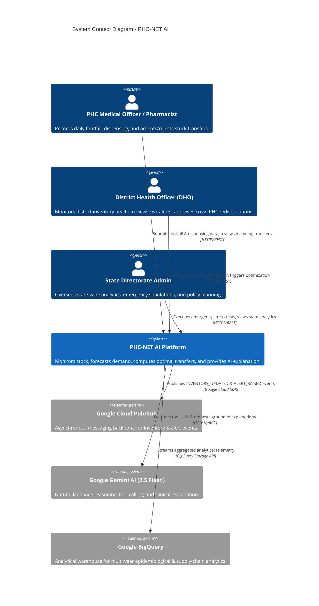
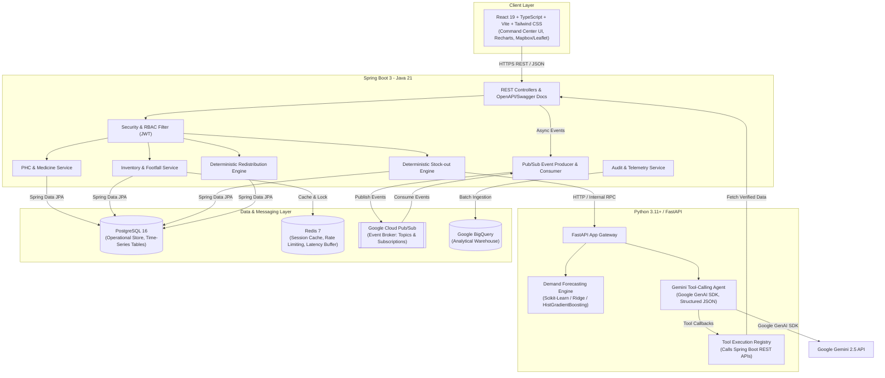
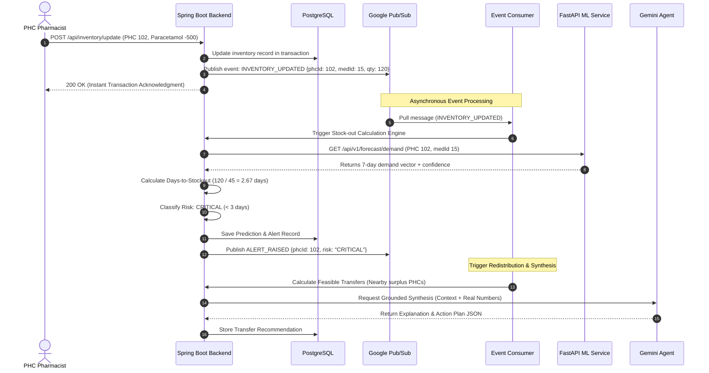

# System Architecture Specification - PHC-NET AI

## 1. Executive Summary & Vision

**PHC-NET AI** is an enterprise-grade, distributed, AI-augmented healthcare resource and medicine supply-chain management platform tailored for India's Primary Health Centre (PHC) network. 

In India's rural and semi-urban public health infrastructure:
- Over 30,000 PHCs cater to 70%+ of the nation's primary care demand.
- Fragmented data silos, manual logbooks, supply-chain bottlenecks, and erratic patient surges (e.g., seasonal dengue, malaria, monsoon gastrointestinal epidemics) cause critical medicine stock-outs.
- When stock-outs happen at one PHC, neighboring PHCs in the same district or block frequently hold surplus buffer inventory that expires unused.

PHC-NET AI solves this by coupling:
1. **Deterministic Core Engines** for invariant mathematical reliability (stock-out days calculation, risk stratification, linear-programming redistribution optimization).
2. **Machine Learning Forecasting** (FastAPI, scikit-learn, time-series regression) for empirical demand and footfall anticipation.
3. **Google Gemini Reasoning Layer** (Google GenAI SDK with structured function/tool calling) acting as an intelligent reasoning and clinical explanation assistant without ever fabricating deterministic quantities or medical claims.
4. **Event-Driven Resilience** via Google Cloud Pub/Sub and BigQuery for analytical auditability and cross-district governance.

---

## 2. Architectural Principles & Non-Negotiable Tenets

1. **Deterministic Separation of Concerns**:
   - Math is handled by code, not LLM hallucinations. Stock-out days, transfer quantities, transport costs, and safety stock constraints are computed strictly by deterministic algorithms in Spring Boot and Python.
   - LLMs (Google Gemini) serve strictly as an explanation, reasoning, synthesis, and natural language tool-calling interface.
2. **Ground Truth & Anti-Hallucination**:
   - If the database or forecasting engine cannot provide data for a query, the system explicitly returns "Data Unavailable" rather than allowing speculative generation.
3. **Auditability & Traceability**:
   - Every risk score calculation and optimization recommendation maintains a complete mathematical trail (formula, parameters, before-and-after projections).
4. **Cloud-Native & Hybrid Deployability**:
   - Runs locally via Docker Compose or natively with standard runtime tools (Java 21, Python 3.11+, Node 22, PostgreSQL). Deploys to Google Cloud (Cloud Run, Cloud SQL, Pub/Sub, BigQuery) without architectural rewrites.

---

## 3. High-Level System Architecture (C4 Model)

### 3.1 Context Diagram (System in Environment)

---

### 3.2 Container Diagram (Services & Storage)

---

## 4. Component Deep Dive

### 4.1 Core Backend (Java 21 / Spring Boot 3)
- **Framework**: Spring Boot 3.3+, Spring Data JPA, Spring Security, Spring Actuator.
- **Domain Responsibilities**:
  - Master Data Management (PHCs, Medicines, District boundaries).
  - Transactional Inventory Management (Stock logging, batches, expiry tracking, physical counts).
  - Patient Footfall Registration (OPD count, seasonal demographic split).
  - Deterministic Stock-out Risk Stratification (Formulas executed in microseconds).
  - Deterministic Optimization Solver for Inter-PHC Stock Redistribution.
  - Role-Based Access Control (RBAC): `ROLE_ADMIN`, `ROLE_DISTRICT_OFFICER`, `ROLE_PHC_MANAGER`.

### 4.2 Machine Learning & AI Service (Python / FastAPI)
- **Framework**: Python 3.11+, FastAPI, Pydantic v2, Scikit-Learn, Pandas, Google GenAI SDK.
- **Forecasting Component**:
  - Model pipeline trained on multi-feature time series: historical daily demand, patient footfall, day-of-week, month/seasonality indicators, district geographical cluster, and holiday flags.
  - Generates 7-day rolling demand predictions per PHC-medicine pair.
  - Employs an Explainable Baseline (7/14-day exponential moving average) alongside an ML Regressor (HistGradientBoosting / Ridge), returning real metrics ($MAE$, $RMSE$, $MAPE$).
- **Gemini Agent Component**:
  - Built using Google GenAI SDK with native tool/function calling declarations.
  - Equipped with strict Pydantic schemas for structured JSON output.
  - Bounded by system instructions forbidding fabrication of numbers, inventories, or unsupported medical diagnoses.
  - Injects factual data obtained exclusively through declared tool execution callbacks.

### 4.3 Database Architecture (PostgreSQL 16)
- Strongly typed schema adhering to 3NF for master data and partitioned time-series tables for high-throughput operational records (`demand`, `patient_footfall`).
- Strict relational constraints, foreign keys with referential integrity, and composite B-tree indices for fast querying on `(phc_id, medicine_id, date)`.

---

## 5. Event-Driven Architecture (Google Cloud Pub/Sub)

---

## 6. Deterministic Engines: Mathematical Formulations

### 6.1 Deterministic Stock-Out Calculation Engine
Stock-out risk is never guessed by the LLM. It is calculated deterministically:

$$\text{Average Daily Demand } (\bar{D}) = \frac{1}{N} \sum_{i=1}^{N} D_i$$
$$\text{Projected Daily Demand } (\hat{D}) = \alpha \cdot \bar{D}_{\text{recent}} + (1 - \alpha) \cdot \hat{D}_{\text{ML}}$$
$$\text{Days to Stock-out } (S_{\text{days}}) = \frac{\text{Current Inventory } (I)}{\hat{D}}$$

**Risk Stratification (Configurable Invariant Thresholds)**:
- $S_{\text{days}} < 3.0 \implies \mathbf{CRITICAL}$ (Immediate stock-out imminent)
- $3.0 \le S_{\text{days}} < 7.0 \implies \mathbf{HIGH}$ (Vulnerable within standard procurement cycle)
- $7.0 \le S_{\text{days}} \le 14.0 \implies \mathbf{MEDIUM}$ (Approaching reorder threshold)
- $S_{\text{days}} > 14.0 \implies \mathbf{LOW}$ (Adequate buffer stock)

### 6.2 Redistribution Optimization Engine
When a PHC is classified as CRITICAL or HIGH risk, the optimization engine determines whether any donor PHC $j$ within max transport distance $D_{\max}$ has surplus:

$$\text{Surplus}_j = \max\left(0, I_j - (\text{Safety Stock}_j + \hat{D}_j \times T_{\text{procurement}})\right)$$

**Objective Function**:
$$\min \sum_{j \in \text{Surplus}} \sum_{i \in \text{Deficit}} \left( C_{\text{transit}}(d_{ij}) \cdot q_{ij} + P_{\text{unmet}} \cdot (R_i - \sum_j q_{ij}) \right)$$

**Subject to**:
1. $0 \le \sum_i q_{ij} \le \text{Surplus}_j \quad \forall j$ (Donor cannot compromise its own safety stock)
2. $\sum_j q_{ij} \le \text{Shortage}_i \quad \forall i$ (No destination overstocking)
3. $d_{ij} \le D_{\max}$ (Geographical feasibility constraint, calculated via Haversine distance)
4. Expired or quarantined stock is hard-excluded ($q_{\text{expired}} = 0$).

---

## 7. Security, RBAC & Multi-Tenancy

- **Authentication**: Stateless JWT token authentication with bcrypt password hashing.
- **Authorization / RBAC Matrix**:
  | Action | `ROLE_ADMIN` | `ROLE_DISTRICT_OFFICER` | `ROLE_PHC_MANAGER` |
  |---|:---:|:---:|:---:|
  | View Global Dashboard | Yes | Yes (Filtered by District) | Yes (Filtered by assigned PHC) |
  | Update PHC Inventory | Yes | Yes (District PHCs) | Yes (Assigned PHC ONLY) |
  | Approve Stock Transfer | Yes | Yes (Within District) | Yes (Accept incoming to own PHC) |
  | Trigger Emergency Simulation | Yes | Yes (District level) | No |
  | Access Gemini Assistant | Yes | Yes | Yes (Scoped context) |
- **Data Privacy**: No Patient Personally Identifiable Information (PII) is captured. Patient footfall is strictly tracked as anonymized aggregate headcount and category codes.

---

## 8. Observability & Telemetry

- **Structured Logging**: JSON formatted logs including `traceId`, `spanId`, `service`, `endpoint`, `durationMs`, `statusCode`, and `errorCategory`.
- **Health Probes**: Spring Boot Actuator (`/actuator/health`, `/actuator/metrics`, `/actuator/prometheus`) and FastAPI (`/healthz`).
- **Telemetry Targets**: Ready for Google Cloud Logging, Google Cloud Monitoring, and Prometheus/Grafana scrape targets.
