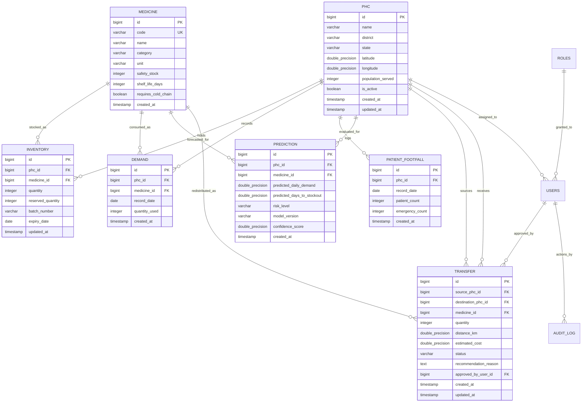

# Database Design Specification - PHC-NET AI

## 1. Overview & Data Philosophy

The data layer for **PHC-NET AI** is architected to satisfy two distinct operational profiles:
1. **Online Transaction Processing (OLTP)**: Low-latency, ACID-compliant transactions for PHC inventory mutations, footfall recording, risk alerts, and transfer workflow state transitions. Powered by **PostgreSQL 16**.
2. **Online Analytical Processing (OLAP)**: Longitudinal time-series queries, epidemiological seasonal pattern analysis, and multi-district supply chain evaluations. Powered by **Google BigQuery**.

---

## 2. PostgreSQL Relational Schema (OLTP)

### 2.1 Entity Relationship Diagram (ERD)



---

## 3. Detailed Table Specifications & DDL

### 3.1 `phcs`
Stores master facility attributes and geographic coordinates for distance matrix calculations.

```sql
CREATE TABLE phcs (
    id BIGSERIAL PRIMARY KEY,
    name VARCHAR(150) NOT NULL,
    district VARCHAR(100) NOT NULL,
    state VARCHAR(100) NOT NULL,
    latitude DOUBLE PRECISION NOT NULL,
    longitude DOUBLE PRECISION NOT NULL,
    population_served INTEGER NOT NULL CHECK (population_served > 0),
    is_active BOOLEAN NOT NULL DEFAULT TRUE,
    created_at TIMESTAMP WITH TIME ZONE NOT NULL DEFAULT CURRENT_TIMESTAMP,
    updated_at TIMESTAMP WITH TIME ZONE NOT NULL DEFAULT CURRENT_TIMESTAMP
);

CREATE INDEX idx_phcs_district ON phcs(district);
CREATE INDEX idx_phcs_geo ON phcs(latitude, longitude);
```

### 3.2 `medicines`
Defines standard catalog items under the National Essential Medicine List (NLEM).

```sql
CREATE TABLE medicines (
    id BIGSERIAL PRIMARY KEY,
    code VARCHAR(50) NOT NULL UNIQUE,
    name VARCHAR(150) NOT NULL,
    category VARCHAR(100) NOT NULL,
    unit VARCHAR(50) NOT NULL,
    safety_stock INTEGER NOT NULL CHECK (safety_stock >= 0),
    shelf_life_days INTEGER NOT NULL DEFAULT 730,
    requires_cold_chain BOOLEAN NOT NULL DEFAULT FALSE,
    created_at TIMESTAMP WITH TIME ZONE NOT NULL DEFAULT CURRENT_TIMESTAMP
);

CREATE INDEX idx_medicines_category ON medicines(category);
```

### 3.3 `inventories`
Transactional inventory balances per facility and medicine, enforcing non-negative balances.

```sql
CREATE TABLE inventories (
    id BIGSERIAL PRIMARY KEY,
    phc_id BIGINT NOT NULL REFERENCES phcs(id) ON DELETE RESTRICT,
    medicine_id BIGINT NOT NULL REFERENCES medicines(id) ON DELETE RESTRICT,
    quantity INTEGER NOT NULL CHECK (quantity >= 0),
    reserved_quantity INTEGER NOT NULL DEFAULT 0 CHECK (reserved_quantity >= 0),
    batch_number VARCHAR(100) DEFAULT 'BATCH-DEFAULT',
    expiry_date DATE NOT NULL,
    updated_at TIMESTAMP WITH TIME ZONE NOT NULL DEFAULT CURRENT_TIMESTAMP,
    CONSTRAINT uq_phc_medicine_batch UNIQUE (phc_id, medicine_id, batch_number)
);

CREATE INDEX idx_inventories_phc_med ON inventories(phc_id, medicine_id);
CREATE INDEX idx_inventories_quantity ON inventories(quantity);
```

### 3.4 `demands` (Time-Series Operational Dispensing)
Daily historical utilization. Partitioned by range on `record_date` for scalability.

```sql
CREATE TABLE demands (
    id BIGSERIAL,
    phc_id BIGINT NOT NULL REFERENCES phcs(id) ON DELETE CASCADE,
    medicine_id BIGINT NOT NULL REFERENCES medicines(id) ON DELETE CASCADE,
    record_date DATE NOT NULL,
    quantity_used INTEGER NOT NULL CHECK (quantity_used >= 0),
    created_at TIMESTAMP WITH TIME ZONE NOT NULL DEFAULT CURRENT_TIMESTAMP,
    PRIMARY KEY (id, record_date),
    CONSTRAINT uq_phc_med_date UNIQUE (phc_id, medicine_id, record_date)
) PARTITION BY RANGE (record_date);

CREATE INDEX idx_demands_query ON demands(phc_id, medicine_id, record_date DESC);
```

### 3.5 `patient_footfalls`
Aggregated daily OPD footfall and emergency acute counts.

```sql
CREATE TABLE patient_footfalls (
    id BIGSERIAL,
    phc_id BIGINT NOT NULL REFERENCES phcs(id) ON DELETE CASCADE,
    record_date DATE NOT NULL,
    patient_count INTEGER NOT NULL CHECK (patient_count >= 0),
    emergency_count INTEGER NOT NULL DEFAULT 0 CHECK (emergency_count >= 0),
    created_at TIMESTAMP WITH TIME ZONE NOT NULL DEFAULT CURRENT_TIMESTAMP,
    PRIMARY KEY (id, record_date),
    CONSTRAINT uq_phc_footfall_date UNIQUE (phc_id, record_date)
) PARTITION BY RANGE (record_date);

CREATE INDEX idx_footfall_date ON patient_footfalls(phc_id, record_date DESC);
```

### 3.6 `predictions`
Persisted output from deterministic risk calculation and ML forecasting service.

```sql
CREATE TABLE predictions (
    id BIGSERIAL PRIMARY KEY,
    phc_id BIGINT NOT NULL REFERENCES phcs(id) ON DELETE CASCADE,
    medicine_id BIGINT NOT NULL REFERENCES medicines(id) ON DELETE CASCADE,
    predicted_daily_demand DOUBLE PRECISION NOT NULL CHECK (predicted_daily_demand >= 0),
    predicted_days_to_stockout DOUBLE PRECISION NOT NULL,
    risk_level VARCHAR(20) NOT NULL CHECK (risk_level IN ('CRITICAL', 'HIGH', 'MEDIUM', 'LOW')),
    model_version VARCHAR(50) NOT NULL,
    confidence_score DOUBLE PRECISION DEFAULT 1.0,
    created_at TIMESTAMP WITH TIME ZONE NOT NULL DEFAULT CURRENT_TIMESTAMP
);

CREATE INDEX idx_predictions_risk ON predictions(risk_level, created_at DESC);
CREATE INDEX idx_predictions_phc_med ON predictions(phc_id, medicine_id, created_at DESC);
```

### 3.7 `transfers`
Audit-trailed stock redistribution proposals, approval states, and delivery logs.

```sql
CREATE TABLE transfers (
    id BIGSERIAL PRIMARY KEY,
    source_phc_id BIGINT NOT NULL REFERENCES phcs(id) ON DELETE RESTRICT,
    destination_phc_id BIGINT NOT NULL REFERENCES phcs(id) ON DELETE RESTRICT,
    medicine_id BIGINT NOT NULL REFERENCES medicines(id) ON DELETE RESTRICT,
    quantity INTEGER NOT NULL CHECK (quantity > 0),
    distance_km DOUBLE PRECISION NOT NULL,
    estimated_cost DOUBLE PRECISION NOT NULL CHECK (estimated_cost >= 0),
    status VARCHAR(30) NOT NULL CHECK (status IN ('PENDING_APPROVAL', 'APPROVED', 'IN_TRANSIT', 'COMPLETED', 'REJECTED')),
    recommendation_reason TEXT,
    approved_by_user_id BIGINT,
    created_at TIMESTAMP WITH TIME ZONE NOT NULL DEFAULT CURRENT_TIMESTAMP,
    updated_at TIMESTAMP WITH TIME ZONE NOT NULL DEFAULT CURRENT_TIMESTAMP,
    CONSTRAINT chk_different_phcs CHECK (source_phc_id <> destination_phc_id)
);

CREATE INDEX idx_transfers_status ON transfers(status);
CREATE INDEX idx_transfers_source ON transfers(source_phc_id);
CREATE INDEX idx_transfers_destination ON transfers(destination_phc_id);
```

### 3.8 `users` & `audit_logs`
Role-Based Access Control (RBAC) and administrative tamper-evident action trail.

```sql
CREATE TABLE users (
    id BIGSERIAL PRIMARY KEY,
    username VARCHAR(80) NOT NULL UNIQUE,
    password_hash VARCHAR(255) NOT NULL,
    full_name VARCHAR(150) NOT NULL,
    email VARCHAR(150) NOT NULL UNIQUE,
    role VARCHAR(50) NOT NULL CHECK (role IN ('ROLE_ADMIN', 'ROLE_DISTRICT_OFFICER', 'ROLE_PHC_MANAGER')),
    assigned_phc_id BIGINT REFERENCES phcs(id) ON DELETE SET NULL,
    assigned_district VARCHAR(100),
    is_active BOOLEAN NOT NULL DEFAULT TRUE,
    created_at TIMESTAMP WITH TIME ZONE NOT NULL DEFAULT CURRENT_TIMESTAMP
);

CREATE TABLE audit_logs (
    id BIGSERIAL PRIMARY KEY,
    user_id BIGINT REFERENCES users(id) ON DELETE SET NULL,
    action VARCHAR(100) NOT NULL,
    entity_type VARCHAR(50) NOT NULL,
    entity_id BIGINT,
    details JSONB,
    ip_address VARCHAR(50),
    created_at TIMESTAMP WITH TIME ZONE NOT NULL DEFAULT CURRENT_TIMESTAMP
);

CREATE INDEX idx_audit_created ON audit_logs(created_at DESC);
```

---

## 4. DTO Pattern & Clean Architecture Separation

Domain entities (`@Entity`) are strictly decoupled from API interfaces:
- **No Entity Leaking**: REST controllers accept and return typed Data Transfer Objects (DTOs) with Jakarta validation annotations (`@NotNull`, `@Positive`, `@Size`).
- **Mapping Layer**: MapStruct or dedicated mapper functions translate between Entities and DTOs.
- **DTO Catalog**:
  - `PhcResponseDTO`, `PhcCreateRequestDTO`
  - `InventoryDTO`, `InventoryUpdateRequestDTO`
  - `StockoutRiskDTO`, `DemandForecastResponseDTO`
  - `TransferRecommendationDTO`, `TransferStatusUpdateDTO`
  - `EmergencySimulationRequestDTO`, `EmergencySimulationResultDTO`

---

## 5. BigQuery Analytical Warehouse Mapping

For macro-level reporting, time-series events are staged in BigQuery with partitioned date columns:
- `analytics.fact_daily_dispensation` (`record_date`, `phc_id`, `district`, `medicine_id`, `quantity_dispensed`, `patient_count`)
- `analytics.fact_stockout_events` (`event_timestamp`, `phc_id`, `medicine_id`, `duration_hours`, `patients_impacted`)
- `analytics.fact_transfer_efficiency` (`transfer_id`, `source_phc_id`, `dest_phc_id`, `medicine_id`, `quantity`, `cost_inr`, `prevented_stockout`)

---

## 6. Synthetic Data Generation Specification (Milestone 1)

To provide an empirical, highly realistic foundation without fabricating real-world government records:

1. **PHC Network (100 Facilities)**:
   - Distributed across 5 realistic Indian districts (e.g., Pune, Nashik, Satara, Ahmednagar, Kolhapur in Maharashtra).
   - Real geographic coordinates bounded by district polygons.
   - Population served modeled with a log-normal distribution ($\mu = 28,000, \sigma = 0.4$).
2. **Essential Medicines (20 Key Drugs)**:
   - Antibiotics: Amoxicillin 500mg, Azithromycin 250mg, Ciprofloxacin 500mg
   - Analgesics/Antipyretics: Paracetamol 500mg, Ibuprofen 400mg
   - Maternal & Child Health: Iron Folic Acid, ORS sachets, Zinc Sulfate
   - Chronic Care: Metformin 500mg, Amlodipine 5mg, Atenolol 50mg
   - Emergency & Critical: Anti-snake Venom, Rabies Vaccine, Dexamethasone, Adrenaline
3. **Historical Time Series (365 Days)**:
   - Footfall generated with weekly seasonality (lower on Sundays, peak on Mondays).
   - Monsoon surge factors (June-September) with $+150\%$ multiplier on ORS, Paracetamol, and Anti-malarials.
   - Cross-facility variance: 75 PHCs with balanced stock, 15 PHCs with critical deficits, and 10 PHCs with excess surplus to seed redistribution feasibility.
